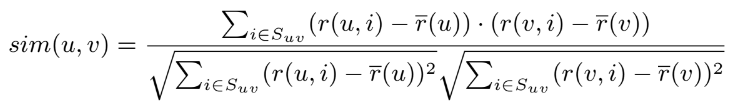
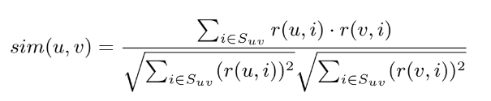
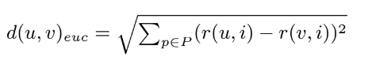

# Práctica de Gestión del Conocimiento en las Organizaciones

## Sistemas de recomendación

### Autor: Dayana Armas Alonso (alu0101228020)

<p align="center">
  <br>
  Programa del sistema de recomendación:<ahref="https://alu0101228020.github.io/RecommenderSystem/">https://alu0101228020.github.io/RecommenderSystem/</a>
  <br>
</p>            

### 1. Introducción

En este repositorio esta la práctica de Sistemas de recomendación que tiene como propósito realizar un sistema recomendador que implemente filtrado colaborativo basado en usuarios.

Para desarrollar esta práctica he utilizado el lenguaje de **JavaScript**, **CSS** y **HTML**. También se ha utilizado el framework de **Materialize** para darle mejor estilo al código HTML.

### 2. Estructura de directorios

Dentro de la carpeta **docs** contamos con los siguientes directorios y ficheros:

- examples: Es un directorio que incluye diferentes ejemplos de matrices de utilidad con las que se puede comprobar el correcto funcionamiento del programa.

- src: Es un directorio que almacena el fichero **form.js** que permite mostrar el formulario donde el usuario debe introducir los datos para que luego se le muestre los resultados y el fichero **recommender.js** que define la clase Recommender que implementa el sistema de recomendación.

- index.html: Es el fichero en HTML que permite crear la página web.

- style.css: Es la hoja de estilo style.css que define el estilo de presentación del documento HTML.

### 3. Descripción del código desarrollado

### Fichero recommender.js

Este fichero contiene la clase del sistema de recomendador donde contamos con los siguientes atributos:

```js
    constructor(utilityMatrix, metricType, numberOfNeighbours, predictionType) {
        this.utilityMatrix= utilityMatrix; // Matriz de utilidad
        this.metricType = metricType; // Tipo de métrica
        this.numberOfNeighbours = numberOfNeighbours; // Número de vecinos
        this.predictionType = predictionType; // Tipo de predicción
        this.similarityMatrix = []; // Matriz de similitud
        this.closeNeighbours = []; // Vecinos más cercanos
        this.calculatePredictions = []; // Cálculos de predicciones
    }
```

**- utilityMatrix:** Corresponde a la matriz de utilidad del fichero introducido donde tenemos como fila los usuarios y como columnas las valoraciones numéricas y las valoraciones vacías representadas como '-'.

**- metricType:** Corresponde a una cadena de texto con el tipo de métrica seleccionada que puede ser Pearson, Coseno y Euclidea.

**- numberOfNeighbours:** Corresponde al número de vecinos más cercanos que se ha seleccionado que es de tipo numérico.

**- predictionType:** Corresponde a una cadena de texto con el tipo de predicción seleccionada que puede ser Simple o Media.

**- similarityMatrix:** Corresponde a la matriz de similitud que ha sido calculada y almacenada donde tenemos tanto en las filas como en las columnas los valores de similitud entre usuarios.

**- closeNeighbours:** Corresponde a una matriz con los valores de usuario, ítem de valoración y un vector con los vecinos cercanos a ese usuario. Esto nos servirá para imprimir los vecinos seleccionados en el proceso de predicción.

**- calculatePredictions:** Corresponde a una matriz con los cálculos de las predicciones con los valores de usuario, ítem de valoración, resultado superior de la ecuación de predicción, resultado inferior de la ecuación de la predicción, la media de usuario (solo en el caso de la ecuación de la predicción Media) y el resultado final de dicha predicción.

Como métodos de la clase tenemos los siguientes:

### getUtilityMatrix()

Corresponde al getter de matriz de utilidad.

### getSimilarityMatrix() 

Corresponde al getter de matriz de similitud.

### getCloseNeighbours()

Corresponde al getter de vecinos cercanos.

### getMetricType()

Corresponde al getter de tipo de métrica.

### getCalculatePredictions()

Corresponde al getter de cálculos de predicciones.

### setUtilityMatrix(utilityMatrix)

Corresponde al setter de matriz de utilidad.

### setSimilarityMatrix()

Corresponde al setter de matriz de similitud que nos permite realizar la matriz de similitud según la métrica seleccionada y almacenarla en el atributo de la clase. 

```js
    setSimilarityMatrix() {
        let similarityMatrix = [];
        for (let i = 0; i < this.utilityMatrix.length; i++){
            similarityMatrix.push([]);
            for (let k = 0; k < this.utilityMatrix.length; k++) {
                if (this.metricType == 'Pearson') {
                    similarityMatrix[i][k] = this.pearson(i, k);
                }
                if (this.metricType  == 'Coseno') {
                    similarityMatrix[i][k] = this.cosine(i, k);
                }
                if (this.metricType  == 'Euclidea') {
                    similarityMatrix[i][k] = this.euclidean(i, k);
                }
            }
        }
        this.similarityMatrix = similarityMatrix;
    }
```

Para ello creamos una matriz nueva donde recorremos con dos `for()` las filas de la matriz de utilidad que corresponden a los usuarios. Luego, calculamos la similitud de un usuario con él mismo y todos sus usuarios vecinos. Luego actualizamos el atributo de la matriz de similitud de la clase.

### setMetricType(metricType)

Setter de tipo de métrica.

### setNumberOfNeighbours(numberOfNeighbours)

Setter de número de vecinos.

### setPredictionType(predictionType)

Setter de tipo de predicción.

### emptyCloseNeighbours()

Método para vaciar el atributo de vecinos cercanos.

### emptyCalculatePredictions()

Método para vaciar el atributo de cálculos de predicciones.

### emptyItem()

Método que nos permite encontrar los items no calificados, es decir, los guiones. 

```js 
    emptyItem() {
        let items = [];
        for (let i = 0; i < this.utilityMatrix.length; i++) {
            for (let j = 0; j < this.utilityMatrix[0].length; j++) {
                if (this.utilityMatrix[i][j] === '-') {
                    items.push([i,j]);
                }
            }
        }
        return items;
    }
```

Para ello, recorremos con dos `for()` para las filas y columnas y donde exista un '-', almacenamos en un vector de vectores nuevo, el usuario y el ítem no calificado, es decir, las posiciones de donde se ha encontrado el '-'.

### recommend()

Método que nos permite obtener la matriz resultante de utilidad con las predicciones según el tipo de predicción seleccionada.

```js
    recommend() {
        let predictionMatrix = [];
        let users = this.emptyItem();
        for (let i = 0; i < this.utilityMatrix.length; i++) {
            predictionMatrix[i] = this.utilityMatrix[i].slice();
        }
        for (let i = 0; i < users.length; i++){
            if (this.predictionType == 'Simple'){
                predictionMatrix[users[i][0]][users[i][1]] = this.simplePrediction(users[i][0], users[i][1]);
            }
            if (this.predictionType == 'Media'){
                predictionMatrix[users[i][0]][users[i][1]] = this.averagePrediction(users[i][0], users[i][1]);
            }
        }
        return predictionMatrix;
    }
```

En primer lugar hacemos una copia de la matriz de utilidad, para ello, en el primer `for()` recorremos la matriz de utilidad por filas y a través de la función `slice()`, copiamos dicho vector de fila en la nueva variable creada que contiene la matriz de utilidad. Luego obtenemos las posiciones donde existen ‘-’ en la matriz de utilidad a través de la función `emptyItem()`, recorremos esas posiciones con un `for` y dependiendo del tipo de predicción que sea, Simple o Media, llamamos a la función que realiza el cálculo de la predicción y le pasamos por parámetro el usuario que se encontrará en la primera posición del vector que estemos recorriendo que es la 0 y el ítem no calificado que se corresponde con la segunda posición que es 1. La predicción que nos devuelva la colocamos en la copia de la matriz de utilidad en las posiciones del usuario y del ítem no calificado que estamos analizando. De esta forma, cambiamos el '-' por el valor de predicción.

### calculateNeighbours(u,i)

Método que nos permite calcular los vecinos cercanos de cada usuario según el número de vecinos seleccionados.

```js
calculateNeighbours(u,i) {
        let neighbours = [];
        let neighboursSelection= [];

        for (let j = 0; j < this.utilityMatrix.length; j++){
            if (u != j) neighbours.push({index: j, sim: this.similarityMatrix[u][j]});
        }

        if ((this.metricType == "Pearson") || (this.metricType == "Coseno")) neighbours.sort((a, b) => b.sim - a.sim);
        else neighbours.sort((a, b) => a.sim - b.sim);

        let j = 0;
        while(neighboursSelection.length < this.numberOfNeighbours && j < neighbours.length){
            if (this.utilityMatrix[neighbours[j].index][i] != '-') {
                neighboursSelection.push(neighbours[j]);
            }
            j++;
        }
        this.closeNeighbours.push([u,i,neighboursSelection]);
        return neighboursSelection;
    }
 ```

Para ello, le pasamos a la función como parámetro el usuario sobre el que queremos ver sus vecinos cercanos y la posición del ítem no calificado. A través del primer `for()` recorremos por filas la matriz de utilidad que corresponde a los usuarios y si el usuario a valorar es distinto del número de la iteración de j, es decir, que si es distinto de sí mismo, metemos en un nuevo vector de vecinos un objeto de vecino donde dicho objeto tendrá como valores el parámetro `index` que corresponde al índice del vecino que sería la j y `sim` que corresponde al valor de similitud de dicho vecino que lo extraemos de las posiciones u y j del atributo de la matriz de similitud. Luego, si el tipo de métrica es `Pearson` o `Coseno`, ordenamos el vector de objetos de vecinos según su similitud de mayor a menor a través de la función `sort()` con `b.sim - a.sim`. En caso contrario, es decir, que el tipo de métrica sea `Euclidea`, ordenamos los vecinos de menor a mayor según su similitud `a.sim - b.sim`. Seguidamente, a través de un `while()` guardamos los vecinos en un nuevo vector cuyos valores de similitud sean mayores teniendo en cuenta sólo aquellos que tengan un valor en la posición del ítem no calificado del usuario que estamos analizando, es decir, que en esa posición no tengan un ‘-’. Solo guardaremos los vecinos necesarios hasta llegar al límite de la selección de vecinos, en caso de que no haya más vecinos para seleccionar y no hayamos llegado al número de vecinos que se ha escogido, trabajaremos con los vecinos actuales. En este método vamos actualizando el atributo `closeNeighbours` realizando un push con el usuario, ítem y un vector de objetos de sus vecinos.

### getUserMean(i)

Método que nos permite realizar la media de ítems de un usuario.

```js
    getUserMean(i){
        const userCalifications = this.utilityMatrix[i];
        let numOfCalifications = 0;
        let sumCalifications = 0;

        for (let j = 0; j < userCalifications.length; j++) {
            if (userCalifications[j] != '-') {
                sumCalifications = sumCalifications + Number(userCalifications[j]);
                numOfCalifications++;
            }
        }
        return sumCalifications / numOfCalifications;
    }
```

En este método ealizamos la media de ítems del usuario pasado por parámetro a la función. Solo tenemos en cuenta aquellos ítems que no tengan como valor  ‘-’, por lo tanto, solo hacemos la media entre los ítems calificados de ese usuario.

### pearson(u,v)

En este método realizamos el algoritmo de correlación de Pearson entre dos usuarios que se trata de un índice que se puede emplear para medir la relación entre dos variables cuantitativas y continuas. Para ello, se calculan las medias para ambos usuarios, después se recorre por ítems la matriz de utilidad comprobando que el ítem haya sido calificado por ambos usuarios, y se calcula la siguiente fórmula:



### cosine(u,v)

En este método realizamos el algoritmo de distancia Coseno entre dos usuarios que consiste en que si dos vectores tienen exactamente la misma orientación (el ángulo que forman es 0 grados) su coseno toma el valor de 1, si son perpendiculares (forman un ángulo de 90 grados) su coseno es 0 y si tienen orientaciones opuestas (ángulo de 180 grados) su coseno es de -1. Para ello, se recorre por ítems la matriz de utilidad comprobando que el ítem haya sido calificado por ambos usuarios, y se calcula la siguiente fórmula:



### euclidean(u,v)

En este método realizamos el algoritmo de distancia Euclídea entre dos usuarios que entre dos puntos p y q define la longitud del segmento que une ambos. Para ello, se recorre por ítems la matriz de utilidad comprobando que el ítem haya sido calificado por ambos usuarios, y se calcula la siguiente fórmula:



### simplePrediction(u,i)

En este método calculamos el valor desconocido de predicción utilizando las calificaciones asignadas a los ítems i de los usuaros v más parecidos (vecinos más próximos).
Para ello, obtenemos el número de vecinos seleccionados y los recorremos aplicando la siguiente fórmula:


### averagePrediction(u,i)

En este método calculamos el valor desconocido de predicción como en el anterior caso pero teniendo en cuenta la media de calificaciones de los usuarios.
Para ello, obtenemos el número de vecinos seleccionados y los recorremos aplicando la siguiente fórmula:

### Fichero form.js

En este fichero tenemos las funciones que nos permiten coger los id’s de las distintas opciones del valor del formulario, tenemos el proceso de ejecución al hacer ‘clic’ al botón de mostrar resultados y las distintas funciones que nos permiten imprimir los resultados.

En primer lugar, tenemos la creación del objeto de la clase Recommender junto a las siguientes funciones asíncronas que lanzan los siguientes eventos:

```js
// Creamos objeto de recomendador
let recommender = new Recommender([], "", 3, "");

// Cogemos los datos del fichero introducido
const fileInput = document.getElementById('matrix');
fileInput.addEventListener('change', fileToMatrix);

// Cogemos el tipo de métrica seleccionada
const metricType = document.getElementById('selectMetric');
metricType.addEventListener('change', function(e) {
    recommender.setMetricType(e.target.value);
});

// Cogemos los vecinos seleccionados
const numberOfNeighbours = document.getElementById('neighbour');
numberOfNeighbours.addEventListener('change', function(e) {
    recommender.setNumberOfNeighbours(e.target.value);
});

// Cogemos el tipo de predicción seleccionada
const predictionType = document.getElementById('selectPrediction');
predictionType.addEventListener('change', function(e) {
    recommender.setPredictionType(e.target.value);
});
```

En el primer caso, cogemos los datos del fichero introducido a través del id y llamamos a la función `fileToMatrix()` que procesa los datos. Al especificar `change` como evento, se repetirá cada vez que cambie el valor del id del html.

En el segundo caso, cogemos el valor del tipo de métrica elegida a través del id y la colocamos en el atributo de la clase correspondiente con la función `setMetricType()`. Al especificar `change` como evento, se repetirá cada vez que cambie el valor del id del html.

En el tercer caso, cogemos el valor del número de vecinos considerados a través del id y lo colocamos en el atributo de la clase correspondiente con la función `setNumberOfNeighbours()`. Al especificar `change` como evento, se repetirá cada vez que cambie el valor del id del html.

En el cuarto caso, cogemos el valor del tipo de predicción elegida a través del id y la colocamos en el atributo de la clase correspondiente con la función `setPredictionType()`. Al especificar `change` como evento, se repetirá cada vez que cambie el valor del id del html.

En el último caso, cogemos el id del botón de mostrar resultados y al hacer ‘clic’ se ejecutará lo siguiente:

- Se hallará la matriz de utilidad con setSimilarityMatrix().

- Se imprimirá la matriz de utilidad en el html con la función printMatrix() donde le pasamos por parámetro la función getUtilityMatrix() para obtener la matriz de utilidad.

- Se imprimirá la matriz de similitud en el html con la función printMatrix() donde le pasamos por parámetro la función getUtilityMatrix() para obtener la matriz de utilidad y la cadena a colocar como título en las columnas.

- Se imprimirá la matriz de utlidad con las predicciones en el html con la función printMatrix() donde le pasamos por parámetro la función getUtilityMatrix() para obtener la matriz de utilidad, la cadena a colocar como título en las columnas, un booleano a true que nos permite saber si es la matriz final de utilidad con predicciones y la matriz de utilidad que la obtenemos con la función getUtilityMatrix().

- Se imprimirán los vecinos considerados en el proceso de predicción por cada usuario en el html con la función printNeighbours() donde le pasamos como parámetro la función getCloseNeighbours() que nos permite obtener los datos de vecinos.

- Se imprimirán los cálculos de predicción en el html con la función printCalculatePredictions() donde le pasamos como parámetro la función getCalculatePredictions() que nos permite obtener los datos de las predicciones.

- Se vaciará los vectores de los vecinos más cercanos con la función emptyCloseNeighbours().

- Se vaciará los vectores de los cálculos de predicción con la función emptyCalculatePredictions().

A continuación, explicaremos las siguientes funciones que no son de la clase y las utilizamos para recoger datos y adaptarlos o para imprimir datos.

### fileToMatrix()

Esta función nos permite detectar el fichero y procesar sus datos para leerlos y transformarlos a matriz. 

```js
function fileToMatrix(e) {
    if (e.target.files.length < 1) {
      alert("Tienes que subir un fichero de matriz de utilidad");
    }

    const file = fileInput.files[0];
    var reader = new FileReader();
    var matrix = [];
    reader.readAsText(file);

    reader.onload= function() {
        const content = reader.result;
        let arrayLines = content.split("\n");
        let arrayResult = [];
        for (let i = 0; i < arrayLines.length; i++) {
            arrayLines[i] = arrayLines[i].replace("\r", "");
        }
        for (let i = 0; i < arrayLines.length; i++) {
            arrayResult[i] = arrayLines[i].split(" ");
        }
        for (let i = 0; i < arrayResult.length; i++){
            for (let j = 0; j < arrayResult[i].length; j++){
                if (arrayResult[i][j] == "") {
                    arrayResult[i].splice(j,1);
                    j--;
                }
            }
            if (arrayResult[i].length == 0) arrayResult.splice(i,1);
        }
        recommender.setUtilityMatrix(arrayResult);
    }
    return matrix;
}
```

Para ello, a través de varios `for()` quitamos los ‘\n’, ‘\r’ y espacios innecesarios. Luego colocamos los datos en una matriz de vectores y lo actualizamos en la clase con la función setUtilityMatrix().

### printMatrix():

Esta función nos permite imprimir cualquier matriz que le pasemos.

```js
function printMatrix(matrix, element = "Item", solution = false, utilityMatrix = []) {
    let table = '<div class="col s12" id="scrollTable"><table class="stripped"><thead><tr><th> </th>';

    for (let i = 0; i < matrix[0].length; i++) {
        table += '<th> ' + element + " " + (i + 1) + '</th>';
    }
    table += '</tr></thead><tbody>';

    for (let i = 0; i < matrix.length; i++) {
        table += '<tr><th> Usuario ' + (i + 1) + '</th>';
        for (let j = 0; j < matrix[i].length; j++) {
            if (solution == true && utilityMatrix[i][j] == '-') {
                table += '<td class="teal lighten-4">' + Math.round(Number((matrix[i][j]) + Number.EPSILON) * 100) / 100 + '</td>';
            } else if (matrix[i][j] == '-') {
                table += '<td class="teal lighten-4">' + '-' + '</td>';
            } else {
                table += '<td>' + Math.round((Number(matrix[i][j]) + Number.EPSILON) * 100) / 100 + '</td>';
            }
        }
        table += '</tr>';
    }
    table += '</tbody></table></div>';
    return table;
}
```

Para ello como parámetro le colocamos la matriz, el elemento en cadena que queremos que tenga de título las columnas, dado que en la matriz de utilidad serán ítems mientras que en la matriz de similitud son usuarios. Como predeterminado esta items. Luego la solución que nos permite indicar si es la matriz resultante de utilidad con las predicciones o no. Como predeterminado es falso. Y por último, la matriz de utilidad. No todos estos valores son necesarios pasarlos como parámetro, depende del caso de la matriz que se desea imprimir. A través de código en HTML creamos la tabla y tenemos en cuenta tres casos:
Si la solución está a true y en las posiciones que estamos recorriendo en la matriz de utilidad existe un ‘-’, entonces quiere decir que es la matriz final de utilidad con las predicciones y debemos cambiar el ‘-’ por el valor de predicción redondeado.
En caso de que la solución esté a false y exista un guión, quiere decir que estamos imprimiendo la matriz de utilidad y por lo tanto, imprimimos el guión.
En los demás casos, imprimimos el valor redondeado.

### printNeighbours()

Esta función nos permite imprimir los vecinos cercanos de cada usuario. 

```js
function printNeighbours(neighboursVector) {
    let print = '<div class="col s8 offset-s2">';
    for (let i = 0; i < neighboursVector.length; i++){
        print += '<p>Para el <b>Usuario '+ (neighboursVector[i][0] + 1) + '</b> con el <b>item ' + (neighboursVector[i][1] + 1) + '</b> los <b>vecinos seleccionados son: ';
        for (let j = 0; j < neighboursVector[i][2].length; j++) {
            if (j == neighboursVector[i][2].length - 1) print += (neighboursVector[i][2][j].index + 1) + '. </b></p>';
            else print += (neighboursVector[i][2][j].index + 1) + ', ';
        }
    }
    print += '</div>';
    return print;
}
```

Le pasamos el vector de vectores con los valores como parámetro y simplemente accediendo a las distintas posiciones donde hemos guardado cada valor, podemos ir almacenando las distintas cadenas.

### printCalculatePredictions()

Esta función nos permite imprimir los cálculos de predicciones de cada usuario. 

```js
function printCalculatePredictions(predictionsVector, metricType) {
    let print = '<div class="col s8 offset-s2">';
    for (let i = 0; i < predictionsVector.length; i++){
        print += '<p>Cálculo de predicción del <b>Usuario '+ (predictionsVector[i][0] + 1) + '</b> con el <b>item ' + (predictionsVector[i][1] + 1) + '</b>: <b>';
        if (metricType == "Simple") {
            print += Math.round((parseFloat(predictionsVector[i][2]) + Number.EPSILON) * 100) / 100 + ' / ' +
            Math.round((parseFloat(predictionsVector[i][3]) + Number.EPSILON) * 100) / 100 + ' = ' + 
            Math.round((parseFloat(predictionsVector[i][4]) + Number.EPSILON) * 100) / 100 + '. </b></p>';
        }
        else {
            print += Math.round((parseFloat(predictionsVector[i][2]) + Number.EPSILON) * 100) / 100 + ' + (' + 
            Math.round((parseFloat(predictionsVector[i][3]) + Number.EPSILON) * 100) / 100 + ' / ' + 
            Math.round((parseFloat(predictionsVector[i][4]) + Number.EPSILON) * 100) / 100 + ')' + ' = ' +
            Math.round((parseFloat(predictionsVector[i][5]) + Number.EPSILON) * 100) / 100 + '. </b></p>';
        }
    }
    print += '</div>';
    return print;
}
```

Para ello, le pasamos como parámetro el vector de predicción y el tipo de métrica. Dependiendo del tipo de métrica, sabremos el tamaño de cada vector y donde estarán colocados los valores dado que en el caso de la métrica simple tenemos en cuenta los valores de usuario, ítem, resultado superior, resultado inferior y resultado final mientras que en el caso de la media, tenemos en cuenta los mismos más el de la media del usuario. Los valores de predicción serán redondeados.

## 4. Ejemplo de uso

Para realizar el ejemplo de uso debemos tener en cuenta que contamos con los siguientes parámetros que le pedimos al usuario:

- Fichero a introducir
- Tipo de métrica (Despliegue de opciones)
- Vecinos considerados
- Tipo de predicción (Despliegue de opciones)

Motramos el siguiente ejemplo:

<p align="center">
 <a href="https://github.com/alu0101228020/RecommenderSystem/blob/main/docs/media/example.gif">
  
 </a>
</p>


